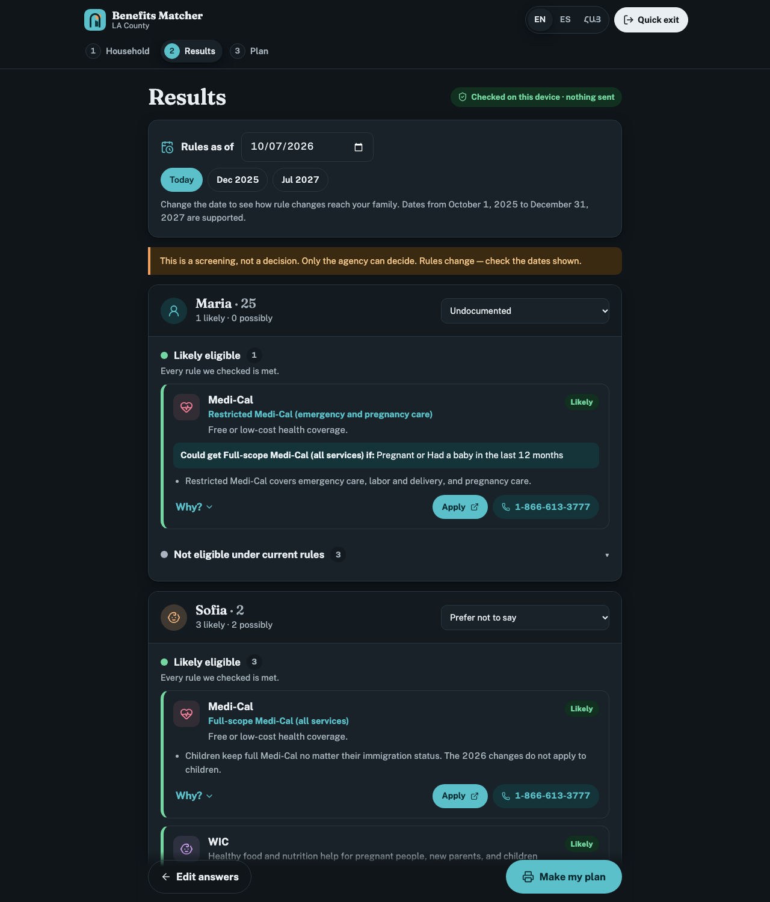
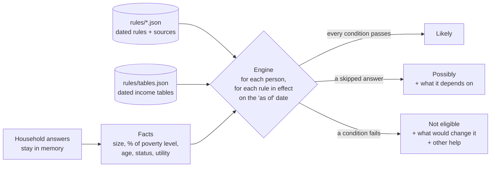

<div align="center">


# Benefits Matcher · LA County

**A private, multilingual screener that shows LA County families which public benefits *each person* in their household may qualify for — under the rules in effect today.**

English · Español · Հայերեն

[](https://github.com/arthurtunyan/benefits-matcher/actions/workflows/ci.yml)


*2026 Congressional App Challenge · California's 30th District*



</div>

---

## Why

Many low-income, immigrant, and mixed-status families in LA County miss help they qualify for. The rules are split across federal, state, county, and city agencies; a U.S.-born child can qualify when a parent can't; and **the rules changed in 2026** (Medi-Cal enrollment freeze, H.R. 1 CalFresh limits, new Medi-Cal rules for refugees). Families also fear that typing immigration details anywhere puts them at risk.

## What it does

| | |
|---|---|
| 👪 **Per-person results** | Every household member gets their own list: *Likely*, *Possibly*, or *Not eligible* — because that's how California benefits actually work. |
| 📅 **Dated rules engine** | Every rule has start and end dates. Change the "as of" date and see the same family under December 2025 rules, today's rules, or rules already scheduled for 2027. |
| 🔗 **Source on every answer** | Each result shows the plain-language rule, the official source link, when it took effect, and when it was last checked. |
| 💡 **Why, why not, what would change it** | "Could get full-scope Medi-Cal if pregnant." "Your income is $446 above this limit." Near misses and other options (food banks, 211, clinics) are shown. |
| 🔒 **Provable privacy** | All screening runs on the device. No server, no cookies, no analytics, no accounts. A Content-Security-Policy blocks the page from contacting any other server. |
| 🖨️ **Bilingual printable plan** | One page, the family's language and English side by side, with programs, where to apply, and a document checklist. |
| 🚌 **Help nearby, by transit** | Local help organizations with "directions by bus or rail" links. The user picks an area — location is never requested. |
| 🚪 **Quick exit** | One tap clears the screen and opens a neutral page, for people on a shared phone. |

### Programs checked (16)

**Health:** Medi-Cal (full and restricted scope), Covered California · **Food:** CalFresh, CFAP, SUN Bucks · **Cash:** CalWORKs, CAPI · **Family:** WIC, Head Start / Early Head Start / State Preschool · **Household:** California LifeLine, LA Metro LIFE, SCE CARE/FERA, SoCalGas CARE, LADWP EZ-SAVE, Burbank Water and Power Lifeline, Glendale Care

## How it works



Every condition returns **pass**, **fail**, or **unknown** (when a question was skipped — "unknown" is not "no"). A rule looks like this:

```json
{
  "id": "medi-cal-restricted-uis",
  "variant": "restricted",
  "effective": { "from": "2026-01-01", "to": null },
  "conditions": { "all": [
    { "fact": "age", "gte": 19 },
    { "fact": "status", "eq": "undocumented" },
    { "fact": "hasMediCal", "eq": false },
    { "fact": "incomePctFPL", "lte": 138 }
  ]},
  "explain": "mc.restricted",
  "source": "https://healthconsumer.org/medi-cal-changes-and-what-you-need-to-know/",
  "lastVerified": "2026-10-07",
  "verifiedBy": "claude-draft"
}
```

A rule change is a data edit, not a code rewrite.

## Quick start

```bash
npm install
```

```bash
npm run dev
```

Open http://localhost:5173 — or http://localhost:5173/#example to jump straight to the example family.

```bash
npm test
```

```bash
npm run build
```

## Project structure

```
rules/                 ← the open dataset (anyone can reuse it)
  programs/*.json      one file per program, each rule dated and sourced
  tables.json          dated income limits and benefit amounts
  program.schema.json  JSON Schema — editors autocomplete rule files
  zips.json            ZIP → area and usual electric utility
  help.json            local help organizations
src/
  engine.ts            the rules engine (pure functions, no I/O)
  data.ts              loads /rules at build time
  i18n.tsx, i18n/      English, Spanish, Armenian
  components/          Start, HouseholdForm, Results, ProgramCard, Plan, Help
tests/
  personas.json        36 households with expected results and sources
  personas.test.ts     the answer key
  rules.test.ts        rule linter: schema, sources, dates, 90-day verification, translations
  engine.test.ts       three-valued logic, dated tables, and a no-network check
docs/                  sources log, submission kit, demo script
PROGRESS.md            what's done, what's left, and who does it
```

## Updating a rule

1. Open the program file in `rules/programs/`. Your editor autocompletes from the schema.
2. **Don't edit old rules** — end them (`"to": "2026-12-31"`) and add a new rule that starts the next day. That keeps the "as of" date accurate.
3. Set `source` to the official page, `lastVerified` to today, and `verifiedBy` to your name.
4. Add or update a persona in `tests/personas.json` whose answer comes from that source.
5. `npm test`. The linter fails if a source, date, or translation is missing, or if any rule hasn't been re-checked in 90 days.

## Privacy

- No server, database, accounts, cookies, analytics, or third-party scripts. Fonts are bundled.
- Answers live only in memory and disappear when the tab closes.
- ZIP code only — never a street address. Immigration status is optional, with "Prefer not to say".
- Production builds ship a `Content-Security-Policy` with `connect-src 'self'`, so the page *cannot* send data elsewhere.
- **Check it yourself:** open DevTools → Network, clear it, run a full screening. Zero requests.

## Accessibility

Plain language (about 6th-grade level), 48px tap targets, WCAG 2.1 AA color contrast in light and dark mode, labels on every input, keyboard and screen-reader friendly, respects reduced motion, works offline after the first visit, installable as an app.

## Disclaimer

This is a screening tool, not a determination. Only the agency that runs a program can decide eligibility. Rules change — every result shows when it was last checked.

## Credits

Built by Arthur and Aiden for the 2026 Congressional App Challenge (CA-30). AI assistance is disclosed in [docs/SUBMISSION.md](docs/SUBMISSION.md#ai-disclosure). Icons: [Lucide](https://lucide.dev) (ISC). Fonts: Public Sans, Fraunces, Noto Sans/Serif Armenian (SIL OFL).

License: [MIT](LICENSE)
